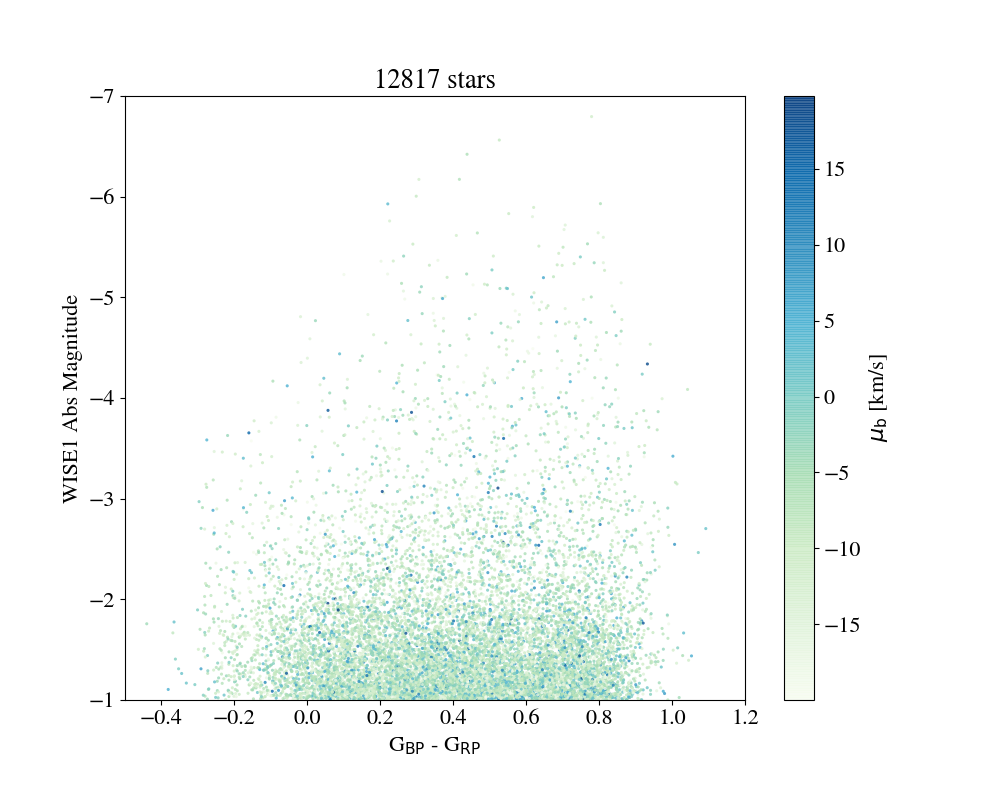

# Massive Stars in Gaia DR2
## Small project started during the Gaiasprint 2018

Special thanks to Alcione Mora, Hans-Walter Rix, Jonathan Gagné and Jackie Faherty

### We have applied the following selection criteria to extract the massive stars from the DR2 release
- Wise mag < -1
- phot_g_mean_mag - w1mpro < 1.5
- w2mpro - w3mpro between -0.4 and 0.2
- parallax_over_error >= 10
- Cut in |b| < 20
- Cut in |$\mu_b$| < 20 km/s

Then we can plot l, b, d=1/parallax etc.

Final vizualization using partiview: [youtube video](https://www.youtube.com/embed/jY-2towHHaY)

